# System Flow Diagram - Collectibles Platform

This diagram shows the general flow of the application and how the main components interact.

```mermaid
flowchart TD
    Start(["HTTP Request<br/>Client"]) --> Router{Spark Router}
    
    Router -->|GET /| HomePage["Home Page<br/>WebController.get('/')"]
    Router -->|GET /ranking| RankingPage["Ranking Page<br/>WebController.get('/ranking')"]
    Router -->|GET /item/:id| ItemDetail["Item Detail<br/>WebController.get('/item/:id')"]
    Router -->|POST /offer| CreateOffer["Create Offer<br/>OfferController.post('/offer')"]
    Router -->|WS /ws/price-updates| WebSocket["WebSocket<br/>PriceUpdateWebSocketHandler"]
    
    HomePage --> ItemService1["ItemService<br/>getAllItems()"]
    RankingPage --> OfferService1["OfferService<br/>getRankedOffers()"]
    ItemDetail --> ItemService2["ItemService<br/>getItemById()"]
    ItemDetail --> OfferService2["OfferService<br/>getOffersByItemId()"]
    
    CreateOffer --> ValidationCheck{Valid Data?}
    ValidationCheck -->|No| ErrorResponse["❌ Error Response"]
    ValidationCheck -->|Yes| OfferService3["OfferService<br/>createOffer()"]
    
    ItemService1 --> DatabaseRead1["DatabaseService<br/>Read Items"]
    ItemService2 --> DatabaseRead2["DatabaseService<br/>Read Item by ID"]
    OfferService1 --> DatabaseRead3["DatabaseService<br/>Read Ranking Offers"]
    OfferService2 --> DatabaseRead4["DatabaseService<br/>Read Offers by Item"]
    OfferService3 --> DatabaseWrite["DatabaseService<br/>Write Offer"]
    
    DatabaseRead1 --> DB1[("🗄️ Database<br/>PostgreSQL")]
    DatabaseRead2 --> DB1
    DatabaseRead3 --> DB1
    DatabaseRead4 --> DB1
    DatabaseWrite --> DB1
    
    ItemService1 --> TemplateRender1["MustacheTemplateEngine<br/>index.mustache"]
    RankingPage --> TemplateRender2["MustacheTemplateEngine<br/>ranking.mustache"]
    ItemDetail --> TemplateRender3["MustacheTemplateEngine<br/>item.mustache"]
    
    TemplateRender1 --> HTMLResponse1["📄 HTML Response<br/>with Items"]
    TemplateRender2 --> HTMLResponse2["📄 HTML Response<br/>Rankings"]
    TemplateRender3 --> HTMLResponse3["📄 HTML Response<br/>Item Detail"]
    ErrorResponse --> End1(["Response to Client"])
    HTMLResponse1 --> End1
    HTMLResponse2 --> End1
    HTMLResponse3 --> End1
    
    WebSocket --> WSManager["PriceUpdateWebSocketHandler<br/>Manage WS Connections"]
    WSManager --> WSBroadcast["Broadcast Updates<br/>Real-time prices"]
    WSBroadcast --> ClientUpdate["📡 Client Update<br/>item-detail-app.js"]
    ClientUpdate --> WSEND(["Active WS Connection"])
    
    %% Estilos (Blanco y Negro)
    style Start fill:#FFFFFF, stroke:#333, color:#000
    style End1 fill:#FFFFFF, stroke:#333, color:#000
    style WSEND fill:#FFFFFF, stroke:#333, color:#000
    style DB1 fill:#FFFFFF, stroke:#333, color:#000
    style ValidationCheck fill:#FFFFFF, stroke:#333, color:#000
    style Router fill:#FFFFFF, stroke:#333, color:#000
    style ErrorResponse fill:#FFFFFF, stroke:#333, color:#000

    style HomePage fill:#FFFFFF, stroke:#333, color:#000
    style RankingPage fill:#FFFFFF, stroke:#333, color:#000
    style ItemDetail fill:#FFFFFF, stroke:#333, color:#000
    style CreateOffer fill:#FFFFFF, stroke:#333, color:#000
    style WebSocket fill:#FFFFFF, stroke:#333, color:#000
    style ItemService1 fill:#FFFFFF, stroke:#333, color:#000
    style OfferService1 fill:#FFFFFF, stroke:#333, color:#000
    style ItemService2 fill:#FFFFFF, stroke:#333, color:#000
    style OfferService2 fill:#FFFFFF, stroke:#333, color:#000
    style OfferService3 fill:#FFFFFF, stroke:#333, color:#000
    style DatabaseRead1 fill:#FFFFFF, stroke:#333, color:#000
    style DatabaseRead2 fill:#FFFFFF, stroke:#333, color:#000
    style DatabaseRead3 fill:#FFFFFF, stroke:#333, color:#000
    style DatabaseRead4 fill:#FFFFFF, stroke:#333, color:#000
    style DatabaseWrite fill:#FFFFFF, stroke:#333, color:#000
    style TemplateRender1 fill:#FFFFFF, stroke:#333, color:#000
    style TemplateRender2 fill:#FFFFFF, stroke:#333, color:#000
    style TemplateRender3 fill:#FFFFFF, stroke:#333, color:#000
    style HTMLResponse1 fill:#FFFFFF, stroke:#333, color:#000
    style HTMLResponse2 fill:#FFFFFF, stroke:#333, color:#000
    style HTMLResponse3 fill:#FFFFFF, stroke:#333, color:#000
    style WSManager fill:#FFFFFF, stroke:#333, color:#000
    style WSBroadcast fill:#FFFFFF, stroke:#333, color:#000
    style ClientUpdate fill:#FFFFFF, stroke:#333, color:#000
```

## Flow Description:

1. **Entry**: Client makes an HTTP request
2. **Routing**: Spark Java router directs the request to the appropriate controller
3. **Controllers**: 
   - `WebController`: Handles web routes (HTML pages)
   - `OfferController`: Handles offer operations
   - `ItemController`: Handles item operations
   - `UserController`: Handles user operations
4. **Services**: Services contain business logic
5. **Database**: PostgreSQL stores and retrieves data through JDBI
6. **Template Engine**: Mustache renders HTML templates with data
7. **WebSocket**: Maintains real-time connections for price updates
8. **Response**: Client receives the response (HTML or JSON)
