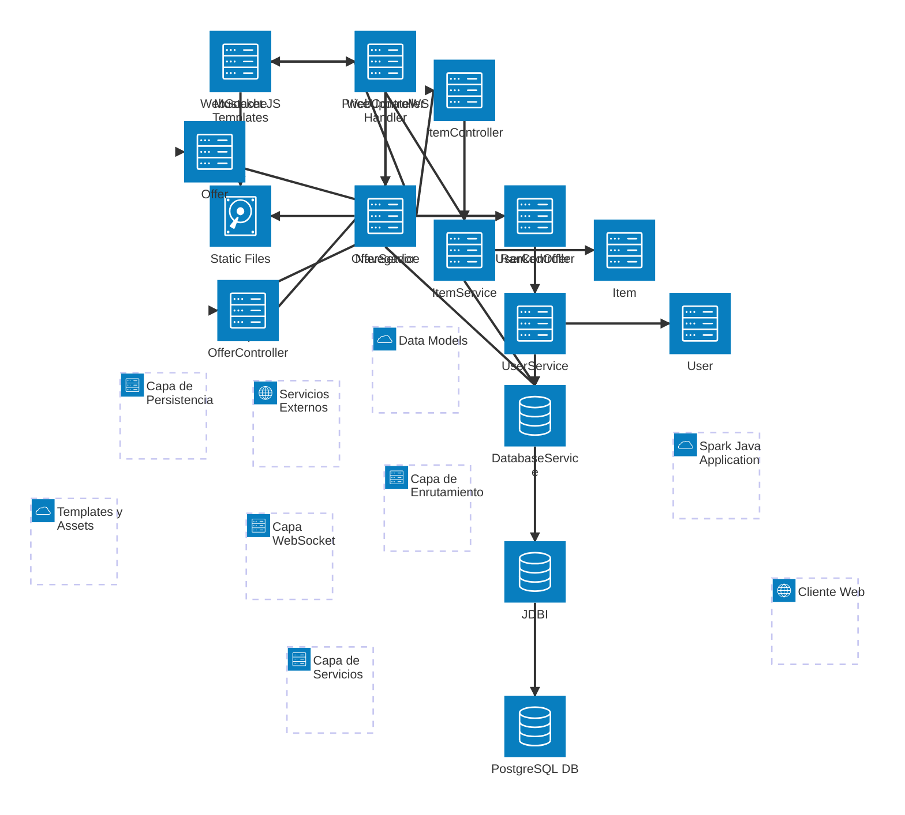

# Diagrama de Arquitectura de Módulos - Collectibles Platform

Este diagrama muestra la arquitectura de componentes del sistema y cómo interactúan entre sí.

## Componentes Principales:

### 1. **Cliente Web**
- **Navegador**: Realiza solicitudes HTTP
- **WebSocket JS**: Mantiene conexión en tiempo real para actualizaciones de precios

### 2. **Spark Java Application**

#### Capa de Enrutamiento:
- **WebController**: Maneja rutas SSR para páginas HTML (/, /ranking, /item/:id)
- **ItemController**: API REST para items
- **OfferController**: API REST para ofertas
- **UserController**: API REST para usuarios

#### Capa de Servicios:
- **ItemService**: Lógica de items (filtros, búsqueda, CRUD)
- **OfferService**: Lógica de ofertas (validación, ranking, creación)
- **UserService**: Lógica de usuarios (gestión en memoria)

#### Capa WebSocket:
- **PriceUpdateWSHandler**: Maneja conexiones WebSocket para actualizaciones en tiempo real

#### Capa de Persistencia:
- **DatabaseService**: Inicializa y gestiona conexión a BD
- **JDBI**: Mapper de resultados SQL a objetos Java

### 3. **Modelos de Datos**
- **Item**: Artículo coleccionable
- **Offer**: Puja/Oferta en un artículo
- **User**: Usuario del sistema
- **RankedOffer**: Oferta con ranking y datos del item

### 4. **Templates & Assets**
- **Mustache Templates**: Plantillas HTML para renderizado en servidor
- **Static Files**: CSS, JavaScript y recursos HTML estáticos

### 5. **Servicios Externos**
- **PostgreSQL DB**: Base de datos relacional para persistencia

## Flujos de Comunicación:

1. **Flujo HTTP tradicional**:
   - Browser → WebController → ItemService → DatabaseService → JDBI → PostgreSQL
   - DatabaseService → ItemService → WebController → Mustache → Browser

2. **Flujo WebSocket**:
   - WebSocket JS (Browser) → PriceUpdateWSHandler
   - PriceUpdateWSHandler → Broadcast a todas las sesiones activas
   - Sessions activas → item-detail-app.js → Actualiza precios en tiempo real

3. **Flujo REST API**:
   - Browser → ItemController/OfferController → Services → Database
   - Database → Services → Controllers → JSON Response → Browser

## Tecnologías Utilizadas:

- **Framework Web**: Spark Java 2.9.4
- **Base de Datos**: PostgreSQL 42.6.0
- **Mapper SQL**: JDBI 3.38.2
- **Template Engine**: Mustache (Spark)
- **JSON**: GSON 2.10.1
- **Logging**: Logback 1.4.14
- **Build**: Maven 3.9.x
- **Java**: JDK 17
