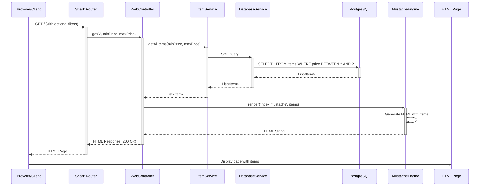
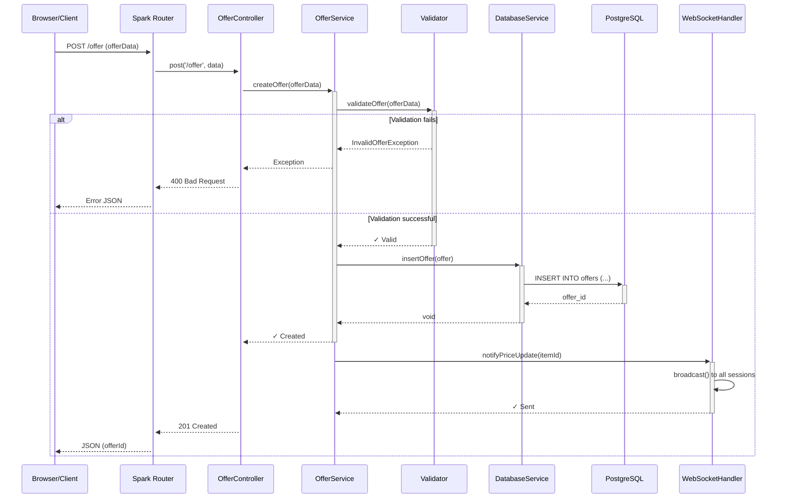
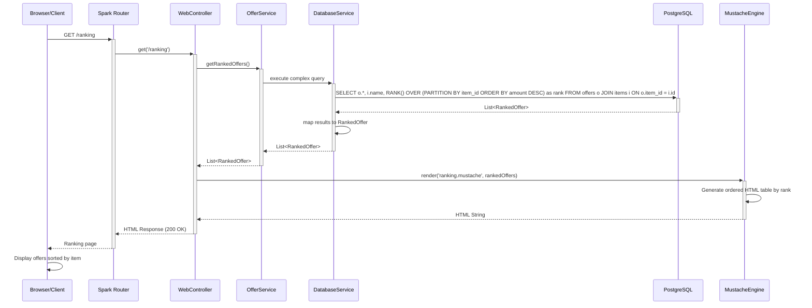
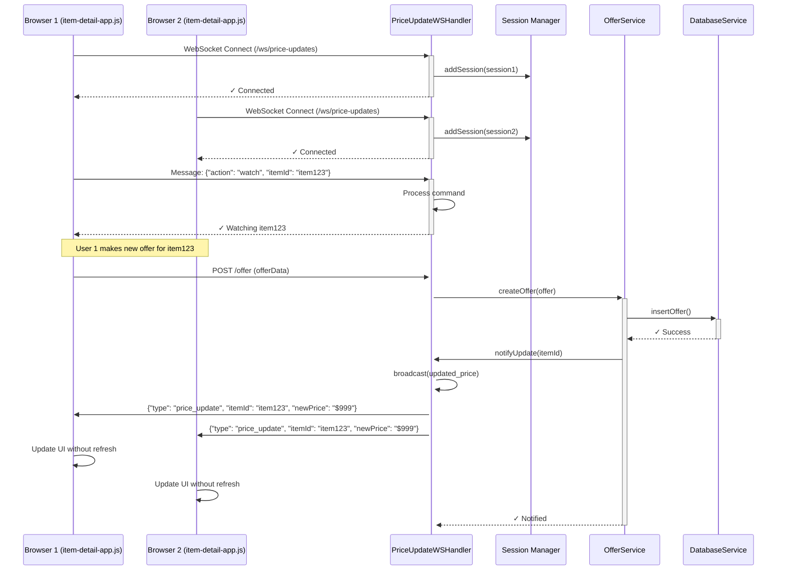
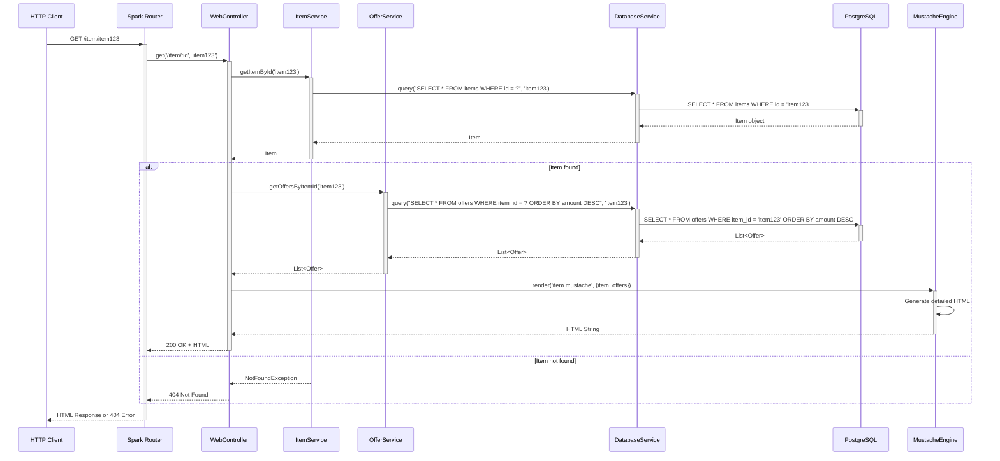

# Sequence Diagrams - Main Flows

This document shows the most important sequence flows of the system.

## 1. Flow: User Views Home Page

## 2. Flow: User Creates New Offer

## 3. Flow: View Offer Rankings

## 4. Flow: Real-time Updates (WebSocket)

## 5. Flow: Get Item Detail

## Legend

| Symbol | Meaning |
|--------|---------|
| `->` | Synchronous call |
| `-->` | Response |
| `+` | Actor activation |
| `-` | Activity end |
| `alt` | Alternative (if/else) |
| `Note` | Comment |
| `par` | Parallel operations |

## Technologies Involved in Flows

- **Spark Java**: Routing and request handling
- **JDBI**: SQL result mapping
- **PostgreSQL**: Persistent storage
- **Mustache**: Template rendering
- **WebSocket**: Real-time communication
- **GSON**: JSON serialization
- **Logback**: Operation logging

---

**Note**: These sequence flows illustrate the most common use cases of the system. Actual flows may vary depending on specific parameters and error conditions.
