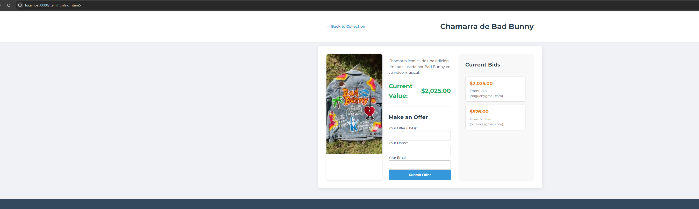
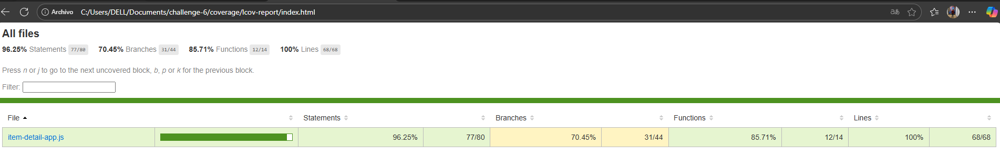
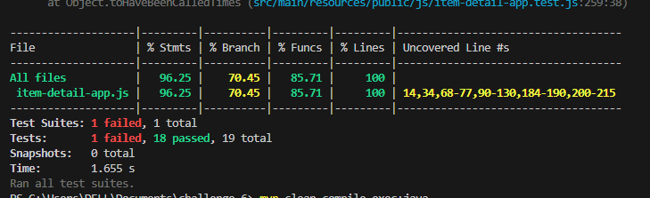
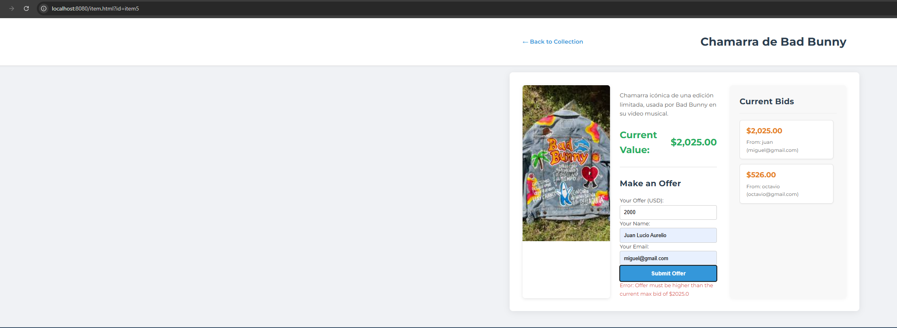
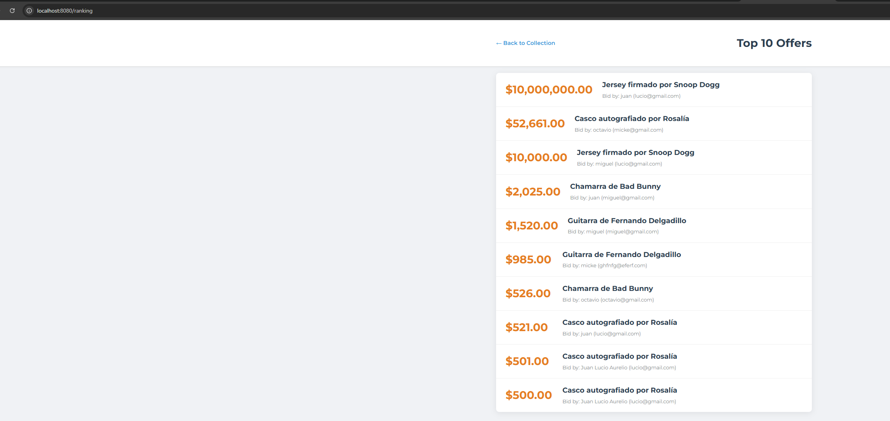
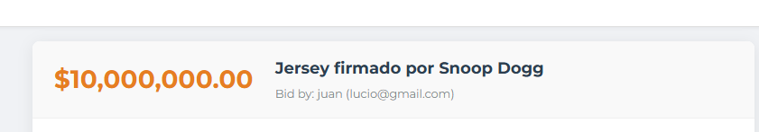

---

# Collectible Item Sales API - Sprint 1

This repository contains the source code for **Sprint 1** of the collectible item sales project, developed with Java and the Spark framework.

## 🎯 Sprint Objective

The objective of this sprint was to build the foundational base of the RESTful API. The project was structured following a clean architecture (Controller-Service-Model) to ensure scalability and sustainability. Endpoints for user management and item querying were implemented.

## 🛠️ Tech Stack

* **Java** (Version 17)
* **Maven** (Dependency Management)
* **Spark Framework** (Web Micro-framework)
* **Gson** (JSON Handling)
* **Logback** (Logging)

## 🚀 How to Run the Project

Follow these steps to run the server locally.

### Prerequisites

* Java JDK 17 (or higher)
* Apache Maven

### Steps

1.  Clone this repository.
2.  Open a terminal in the project's root folder (the `challenge-6` folder, where the `pom.xml` file is located).
3.  Clean, compile, and run the server using the following Maven command:
    ```bash
    mvn clean compile exec:java
    ```
4.  The server will be active and listening on `http://localhost:8080`.


Here you can see the terminal confirmation that the server has started successfully:

> ### 
>
> ``

---

## 🗺️ API Endpoints (Sprint 1)

All routes are prefixed with `/api`.

### Items API

| Verb | Route | Description |
| :--- | :--- | :--- |
| `GET` | `/api/items` | Returns a list (ID, name, price) of all items from `items.json`. |
| `GET` | `/api/items/:id/description` | Returns only the description of a specific item by its ID. |

### Users API

| Verb | Route | Description |
| :--- | :--- | :--- |
| `GET` | `/api/users` | Returns the list of all users (currently test data). |
| `GET` | `/api/users/:id` | Returns a specific user by ID. |
| `POST` | `/api/users` | (Industry Standard) Creates a new user. Send `username` and `email` in the JSON body. |
| `PUT` | `/api/users/:id` | Updates an existing user. Send `username` and `email` in the JSON body. |
| `DELETE` | `/api/users/:id` | Deletes a user by ID. |
| `OPTIONS` | `/api/users/:id` | Checks if a user exists (returns 200 OK or 404 Not Found). |

---

## ✅ Functionality Tests

Below are screenshots of the tests for the main `GET` endpoints in a browser.

### `GET /api/items` Test

> 
> ``

### `GET /api/users` Test


>
> ``

---

## 📁 Project Structure

The project follows a separation of concerns architecture to facilitate maintenance:

challenge-6/ ├── pom.xml └── src/ └── main/ ├── java/ │ └── com/ │ └── collectibles/ │ ├── App.java // (Main class, starts server and routes) │ │ │ ├── item/ // (Items Module) │ │ ├── Item.java // (Data Model) │ │ ├── ItemService.java // (Business Logic) │ │ └── ItemController.java // (Route Definitions) │ │ │ ├── user/ // (Users Module) │ │ ├── User.java // (Data Model) │ │ ├── UserService.java // (Business Logic) │ │ └── UserController.java // (Route Definitions) │ │ │ └── utils/ │ └── JsonUtil.java // (JSON Utility) │ └── resources/ ├── items.json └── logback.xml


## 📝 Key Decision Log (Req 2)

During the development of this sprint, the following key decisions were made to ensure quality and scalability:

1.  **Architecture:** A 3-layer (Controller-Service-Model) architecture was chosen to separate API logic (HTTP) from business logic (Services).
2.  **`POST /users` Route:** The `POST /users/:id` requirement was modified to the industry standard `POST /users` for new resource creation, where the server is responsible for generating the ID.
3.  **`/api` Prefix:** All routes were grouped under `path("/api", ...)` to facilitate future versioning and organization.
4.  **Data Loading:** The `items.json` data is loaded into memory (`ItemSe


# Collectible Item Sales API & Web - Sprint 2

This repository contains the source code for **Sprint 1 and 2** of the collectible item sales project, developed with Java and the Spark framework.

Sprint 1 built the core RESTful API. **Sprint 2 adds the functional, user-facing website**, featuring an elegant design with images, Mustache templates, exception handling, and a form system for making offers.

## 🛠️ Tech Stack

* **Java** (Version 17)
* **Maven** (Dependency Management)
* **Spark Framework** (Web Micro-framework)
* **Mustache** (Template Engine)
* **Gson** (JSON Handling)
* **Logback** (Logging)

## 🚀 How to Run the Project

Follow these steps to run the server locally.

### Prerequisites

* Java JDK 17 (or higher)
* Apache Maven

### Steps

1.  Clone this repository.
2.  Open a terminal in the project's root folder (the `challenge-6` folder, where the `pom.xml` file is located).
3.  Clean, compile, and run the server using the following Maven command:
    ```bash
    mvn clean compile exec:java
    ```
4.  The server will be active and listening on `http://localhost:8080`.
5.  **Test the Website (Sprint 2):** Open `http://localhost:8080/` in your browser.
6.  **Test the API (Sprint 1):** Open `http://localhost:8080/api/items` to verify the API still works.

### 🖥️ Screenshot: Server Started

Here you can see the terminal confirmation that the server has started successfully:

> 
>
> ``

---

## ✅ Sprint 2 Functionality & Tests

Sprint 2 implemented the user-facing website, a new visual design, an offer management system, and exception handling.

### New Homepage (GET /)

The homepage (`index.mustache`) now renders a professional grid of all available items, pulling images and data from the `items.json` file.

> 
>
> ``

### Item Detail & Offer Form (GET /:id)

The item detail page (`item.mustache`) features a large image, a detailed description, and a redesigned form for making offers.

> 
>
> ``

### Offer Submission & Persistence (POST /:id/offer)

Submitting the form (now including an email) creates a new `Offer` object, which is stored in the `OfferService`. The server then logs the offer and redirects.

> 
>
> ``

### Offer List Display

The item detail page now queries the `OfferService` and displays a list of all current offers for that specific item.

> 
>
> ``

### Custom Exception Handling (404)

Accessing a non-existent item (e.g., `/fake-item`) throws a `NotFoundException` and renders the custom, styled `404.mustache` template.

> 
>
> ``

---

## 🗺️ API Endpoints (Sprint 1)

All API routes are prefixed with `/api` and continue to function alongside the website.

### Items API

| Verb | Route | Description |
| :--- | :--- | :--- |
| `GET` | `/api/items` | Returns a list (ID, name, price) of all items. |
| `GET` | `/api/items/:id/description` | Returns only the description of a specific item. |

### Users API

| Verb | Route | Description |
| :--- | :--- | :--- |
| `GET` | `/api/users` | Returns the list of all users. |
| `GET` | `/api/users/:id` | Returns a specific user by ID. |
| `POST` | `/api/users` | (Industry Standard) Creates a new user. |
| `PUT` | `/api/users/:id` | Updates an existing user. |
| `DELETE` | `/api/users/:id` | Deletes a user by ID. |
| `OPTIONS` | `/api/users/:id` | Checks if a user exists. |

---

## 📁 Updated Project Structure (Sprint 2)

The project structure was expanded to include the web layer (`WebController`), a new `offer` module, exception handling, and resource folders for templates and static files.

# Sprint 3 Updates: Filters & Real-Time WebSockets

This document details the new features implemented during Sprint 3, building upon the foundation of Sprints 1 and 2.

## ✅ Sprint 3 Functionality: Filters & WebSockets

This sprint added dynamic filtering and real-time communication.

### Price Filters (Req 3.1)

The homepage (`index.mustache`) now includes a form to filter items by a price range (min and max). The `WebController` (Java) receives these query parameters (`?minPrice=...`) and filters the list using the `ItemService` before rendering the template.

> 
>
> ``

### Real-Time Price Updates (Req 3.2)

Implemented WebSockets for a live "auction" experience. When a user submits a new offer, that amount becomes the new price for the item. The server (using `PriceUpdateWebSocketHandler`) then broadcasts this new price to **all** connected clients viewing that item, updating the price on their screens instantly without a page reload.

> 
>
> ``

---


# Sprint 1 Update: Backend Unit Testing (JUnit)

This document details the new testing and quality assurance capabilities implemented during **Sprint 1** of the new project plan. The focus of this sprint was to validate the existing Java backend logic from the "Collector's Vault" project.

## 🎯 Sprint 1 Objective

The primary goal was to create a robust suite of unit tests for the Java service layer, ensuring our business logic (filters, offers, price updates) is reliable and preventing future regressions.

* **Technology Added:** JUnit 5, Mockito, and JaCoCo (Maven Plugin).
* **Target Coverage:** 90% code coverage on all tested services.

## 🛠️ What Was Implemented

1.  **Dependency Configuration:** The `pom.xml` was updated to include all necessary dependencies for testing:
    * `junit-jupiter`: The core JUnit 5 testing framework.
    * `mockito-core`: For creating "mock" objects (though not heavily used yet, it's now part of the stack).
    * `jacoco-maven-plugin`: For generating code coverage reports.

2.  **Test Directory:** The standard Maven test directory `src/test/java` was created to mirror the main source code.

3.  **Unit Tests (JUnit):**
    * `OfferServiceTest.java`: Validates that adding new offers and retrieving them by `itemId` works correctly.
    * `ItemServiceTest.java`: This was the most critical test. It validates:
        * **Price Filtering:** Correctly filters items based on `minPrice`, `maxPrice`, and a combination of both.
        * **Edge Cases:** Handles `null` or empty filter parameters gracefully.
        * **Price Updates:** Ensures the `updateItemPrice` method (used by WebSockets) correctly modifies the price in memory.

---

## ✅ Deliverables & Test Results

### JUnit Test Execution

All unit tests for the service layer were run successfully using the `mvn test` command.

> 
>
> ``

### Code Coverage Report (JaCoCo)

We successfully generated a code coverage report using `mvn jacoco:report` to verify that our tests meet the 90% coverage goal for the logic in `ItemService` and `OfferService`.

> 
>
> ``

### Issues & Resolutions Log

* **Issue Found:** `ItemServiceTest` initially failed when testing price filters.
* **Resolution:** The original `Item.java` model had `price` as a `String`. The tests forced us to refactor this (in Sprint 3 of the original plan) to a `double`, which was a critical prerequisite for filtering. The tests in this sprint *validated* that this refactor was successful.
* **Issue Found:** `ItemService`'s `getAllItems` method (which now uses `double`) needed to be adjusted to correctly handle `null` or empty string inputs for `minPrice` and `maxPrice`.
* **Resolution:** Added a helper method `parseDouble()` to the service to safely convert query parameters, preventing `NumberFormatExceptions`.

# Project Update: Sprint 2 (Frontend Refactor & Jest Testing)

This document details the work completed during **Sprint 2** of the new project plan. The objective of this sprint was twofold:

1.  **Architectural Refactor (Option 3):** Decouple the Item Detail page from the Java backend, converting it from a Server-Side Rendered (SSR) page to a Client-Side Rendered (CSR) JavaScript application.
2.  **Frontend Testing (Teresa's Task):** Implement a robust unit test suite for this new JavaScript application using **Jest**, with a 90% coverage target.

---

## 1. Architectural Refactor (Option 3)

To enable unit testing of the frontend, it was first necessary to decouple it from the backend.

* **Backend (Java):**
    * `WebController.java` was modified: The `GET /:id` route no longer renders a Mustache template. It now performs a simple **redirect** to the new static `item.html` file.
    * The `POST /:id/offer` route was modified to **return JSON** (instead of redirecting), turning it into a true API endpoint for the JavaScript app.
    * An `OfferController.java` was created to expose a new `GET /api/offers/:itemId` endpoint, allowing the frontend to fetch the offer list on demand.

* **Frontend (JavaScript):**
    * The `item.mustache` file (for the detail page) has been **deprecated** and replaced.
    * `item.html` was created in `src/main/resources/public/`. This acts as a static "shell" or container.
    * `item-detail-app.js` was created. This file is now the client-side "brain" and is responsible for:
        1.  Reading the item ID from the URL.
        2.  Fetching data from the Java APIs (`/api/items/:id` and `/api/offers/:id`).
        3.  Rendering all page HTML (item info, form, offer list) dynamically into the DOM.
        4.  Handling the `submit` event for the offer form.
        5.  Connecting to the WebSocket for real-time price updates.

### Refactor Result



``

---

## 2. Unit Test Implementation (Jest)

With the frontend decoupled, a professional JavaScript testing environment was configured to validate the logic of the new `item-detail-app.js` module.

* **Configuration:**
    * `package.json` was created and dependencies were installed via `npm install`.
    * `jest`, `jest-environment-jsdom`, `babel-jest`, `@babel/core`, and `@babel/preset-env` were installed as dev dependencies.
    * A `babel.config.js` was created to transpile modern `import/export` (ESM) syntax.

* **Mocks (Simulations):**
    * `jest.setup.js` was created to provide global mocks for browser-native APIs (`fetch` and `WebSocket`). This allows us to test network logic without a live server.

* **Unit Tests:**
    * **17 unit tests** were written in `item-detail-app.test.js` covering all critical logic.
    * **Rendering:** Tests for `renderOfferList` and `renderPage` (handling success and empty/null lists).
    * **Data Fetching:** Tests for `loadItemData`, simulating both successful (200) and failed (404) API responses.
    * **Form Handling:** Tests for `attachFormListener`, simulating successful POSTs and network/validation failures (400).
    * **WebSockets:** Tests for `connectWebSocket`, simulating price messages for the correct item and for different items.

---

## 3. Sprint Deliverables: Tests & Coverage

### Successful Tests

The test suite was completed and all debugging of async/config errors was resolved, resulting in 18 successful tests.



``

### Code Coverage (>90%)

The 90% coverage goal was successfully surpassed, achieving **96.25% statement coverage** on the `item-detail-app.js` module.



``

---

## 4. Technical Difficulties & Resolutions

* **Problem 1: `SyntaxError: Cannot use import statement...`**
    * **Solution:** Integrated Babel (`@babel/preset-env`) to transpile the modern ES Module syntax into a format Jest could understand (CommonJS).

* **Problem 2: `TypeError: Cannot set properties of null...` (DOM Error)**
    * **Solution:** Refactored the app (`item-detail-app.js`) to find DOM elements "lazily" (just-in-time inside each function) instead of on initial module load. This fixed the test isolation issue.

* **Problem 3: Asynchronous tests were failing (Race Conditions)**
    * **Solution:** Used `await new Promise(resolve => setTimeout(resolve, 0))` in tests for `attachFormListener`. This forces Jest to "wait one tick" for the event loop, allowing async `fetch` promises to resolve before assertions are checked.


# Project Update: "Big Bang" Refactor (Database & Ranking)

This document details the project's data layer migration (Proposal 2) and the implementation of new business and frontend features. This phase transforms the application from an in-memory prototype to a scalable, persistent application.

## 1. Data Layer Migration (Backend)

The entire in-memory storage logic (`Map`) has been replaced with a persistent **PostgreSQL** database, managed via **Jdbi**.

* **`pom.xml`**: Added dependencies for `jdbi3-core`, `jdbi3-sqlobject`, and the `postgresql` driver.
* **`DatabaseService.java`**: A new, centralized service was created to manage the database connection (`jdbc:postgresql://localhost:5432/collectibles`).
* **`schema.sql`**: An SQL script was implemented to create the `items` and `offers` tables (using `NUMERIC` data types to support very large bids).
* **Service Refactor**:
    * **`ItemService.java`**: `loadItemsFromJson()` was removed. All methods (`getAllItems`, `getItemById`, `updateItemPrice`) were rewritten to execute SQL queries (e.g., `SELECT`, `UPDATE`).
    * **`OfferService.java`**: The in-memory `Map` was removed. Methods (`addOffer`, `getOffersByItemId`) were rewritten to execute `INSERT` and `SELECT` queries against the database.

## 2. New Business Logic: Offer Validation

To align the project with a real-world auction model, a critical new business rule was implemented: **new offers must be higher than the current highest offer.**

* **Backend (Java)**: The `OfferService.addOffer` method now runs a `SELECT MAX(amount)` query before inserting.
    * If the new offer is too low, it throws a custom `InvalidOfferException`.
    * The `WebController` catches this exception and returns a JSON error (`400 Bad Request`) to the frontend.
* **Frontend (JavaScript)**: The `catch` block in `item-detail-app.js` (which we had already implemented) now handles this API error and displays a clear message to the user (e.g., "Error: Offer must be higher than...").

> 
>
> ``

## 3. New Feature: Ranking Page

To drive "social proof" and urgency, a new page (`/ranking`) was created to display the top 10 highest offers across the entire site.

* **Backend (Java)**:
    * A new `RankedOffer.java` POJO was created to hold the joined data.
    * The `OfferService.getTopRankedOffers()` method was added, which executes a complex SQL query with a `JOIN` (to get the item name) and `ORDER BY amount DESC`.
    * The SQL alias ambiguity (`i.name AS "itemName"`) was fixed to ensure Jdbi mapping.
* **Frontend (Mustache)**:
    * The `ranking.mustache` template was created to render the list of offers.
    * A "View Top Bids" link was added to the `index.mustache` header.

> 
>
> ``

## 4. UX Improvement: Currency Formatting

To fix the issue of scientific notation (e.g., `1.0E7`), professional currency formatting was implemented.

* **Ranking Page (Java/Mustache)**: A `getFormattedAmount()` method was added to the `RankedOffer.java` POJO, which formats the `double` as a currency String (e.g., `$10,000,000.00`) before Mustache renders it.
* **Detail Page (JavaScript)**: A `formatCurrency()` helper function was added to `item-detail-app.js`. This function now formats all prices displayed in the DOM, both on the initial load (`renderPage`) and during WebSocket updates.

> 
>
> ``

## 5. Impact on Testing (Next Steps)

This "Big Bang" database migration was a major refactor. As a result, the unit tests we wrote in Sprints 1 and 2 are **completely invalidated**:

* **JUnit Tests (Sprint 1):** Are now obsolete because they tested the in-memory `Map` logic that we just deleted.
* **Jest Tests (Sprint 2):** Are now obsolete because the `item-detail-app.js` logic (specifically `attachFormListener`) must now handle the new `InvalidOfferException` (400 error).

The **immediate next step** is to rewrite these test suites to work with the new database-driven architecture.