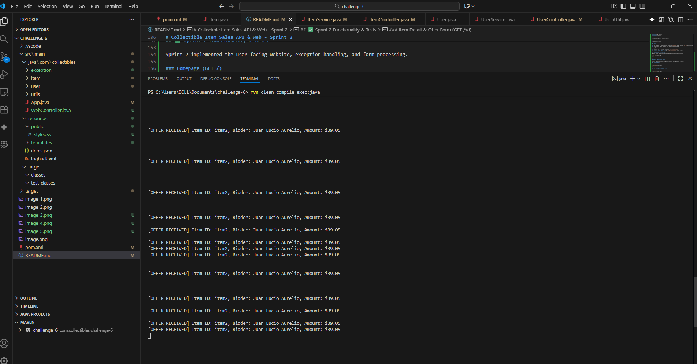

---

# Collectible Item Sales API - Sprint 1

This repository contains the source code for **Sprint 1** of the collectible item sales project, developed with Java and the Spark framework.

## 🎯 Sprint Objective

The objective of this sprint was to build the foundational base of the RESTful API. The project was structured following a clean architecture (Controller-Service-Model) to ensure scalability and sustainability. Endpoints for user management and item querying were implemented.

## 🛠️ Tech Stack

* **Java** (Version 17)
* **Maven** (Dependency Management)
* **Spark Framework** (Web Micro-framework)
* **Gson** (JSON Handling)
* **Logback** (Logging)

## 🚀 How to Run the Project

Follow these steps to run the server locally.

### Prerequisites

* Java JDK 17 (or higher)
* Apache Maven

### Steps

1.  Clone this repository.
2.  Open a terminal in the project's root folder (the `challenge-6` folder, where the `pom.xml` file is located).
3.  Clean, compile, and run the server using the following Maven command:
    ```bash
    mvn clean compile exec:java
    ```
4.  The server will be active and listening on `http://localhost:8080`.

### 

Here you can see the terminal confirmation that the server has started successfully:

> *(Paste your terminal screenshot here, showing the "Servidor API de Coleccionables iniciado..." message)*
>
> ``

---

## 🗺️ API Endpoints (Sprint 1)

All routes are prefixed with `/api`.

### Items API

| Verb | Route | Description |
| :--- | :--- | :--- |
| `GET` | `/api/items` | Returns a list (ID, name, price) of all items from `items.json`. |
| `GET` | `/api/items/:id/description` | Returns only the description of a specific item by its ID. |

### Users API

| Verb | Route | Description |
| :--- | :--- | :--- |
| `GET` | `/api/users` | Returns the list of all users (currently test data). |
| `GET` | `/api/users/:id` | Returns a specific user by ID. |
| `POST` | `/api/users` | (Industry Standard) Creates a new user. Send `username` and `email` in the JSON body. |
| `PUT` | `/api/users/:id` | Updates an existing user. Send `username` and `email` in the JSON body. |
| `DELETE` | `/api/users/:id` | Deletes a user by ID. |
| `OPTIONS` | `/api/users/:id` | Checks if a user exists (returns 200 OK or 404 Not Found). |

---

## ✅ Functionality Tests

Below are screenshots of the tests for the main `GET` endpoints in a browser.

### `GET /api/items` Test

> 
> ``

### `GET /api/users` Test


>
> ``

---

## 📁 Project Structure

The project follows a separation of concerns architecture to facilitate maintenance:

challenge-6/ ├── pom.xml └── src/ └── main/ ├── java/ │ └── com/ │ └── collectibles/ │ ├── App.java // (Main class, starts server and routes) │ │ │ ├── item/ // (Items Module) │ │ ├── Item.java // (Data Model) │ │ ├── ItemService.java // (Business Logic) │ │ └── ItemController.java // (Route Definitions) │ │ │ ├── user/ // (Users Module) │ │ ├── User.java // (Data Model) │ │ ├── UserService.java // (Business Logic) │ │ └── UserController.java // (Route Definitions) │ │ │ └── utils/ │ └── JsonUtil.java // (JSON Utility) │ └── resources/ ├── items.json └── logback.xml


## 📝 Key Decision Log (Req 2)

During the development of this sprint, the following key decisions were made to ensure quality and scalability:

1.  **Architecture:** A 3-layer (Controller-Service-Model) architecture was chosen to separate API logic (HTTP) from business logic (Services).
2.  **`POST /users` Route:** The `POST /users/:id` requirement was modified to the industry standard `POST /users` for new resource creation, where the server is responsible for generating the ID.
3.  **`/api` Prefix:** All routes were grouped under `path("/api", ...)` to facilitate future versioning and organization.
4.  **Data Loading:** The `items.json` data is loaded into memory (`ItemSe


# Collectible Item Sales API & Web - Sprint 2

This repository contains the source code for **Sprint 1 and 2** of the collectible item sales project, developed with Java and the Spark framework.

Sprint 1 built the core RESTful API. **Sprint 2 adds the functional, user-facing website** using Mustache templates, exception handling, and web forms.

## 🛠️ Tech Stack

* **Java** (Version 17)
* **Maven** (Dependency Management)
* **Spark Framework** (Web Micro-framework)
* **Mustache** (Template Engine)
* **Gson** (JSON Handling)
* **Logback** (Logging)

## 🚀 How to Run the Project

Follow these steps to run the server locally.

### Prerequisites

* Java JDK 17 (or higher)
* Apache Maven

### Steps

1.  Clone this repository.
2.  Open a terminal in the project's root folder (the `challenge-6` folder, where the `pom.xml` file is located).
3.  Clean, compile, and run the server using the following Maven command:
    ```bash
    mvn clean compile exec:java
    ```
4.  The server will be active and listening on `http://localhost:8080`.
5.  **Test the Website (Sprint 2):** Open `http://localhost:8080/` in your browser.
6.  **Test the API (Sprint 1):** Open `http://localhost:8080/api/items` to verify the API still works.

### 🖥️ Screenshot: Server Started

Here you can see the terminal confirmation that the server has started successfully:


>
> ``

---

## ✅ Sprint 2 Functionality & Tests

Sprint 2 implemented the user-facing website, exception handling, and form processing.

### Homepage (GET /)

The homepage (`index.mustache`) now renders a list of all available items from the `ItemService`.

> 
>
> ``

### Item Detail & Offer Form (GET /:id)

Clicking an item leads to its detail page (`item.mustache`), which displays the item's description and the new web form for making offers.

> 
>
> ``

### Form Submission (POST /:id/offer)

Submitting the form triggers a POST request. The server logs the offer to the console and uses the Post-Redirect-Get (PRG) pattern to safely reload the page.

> 
>
> ``

### Custom Exception Handling (404)

Accessing a non-existent item (e.g., `/fake-item`) now throws a `NotFoundException` and renders the custom `404.mustache` template.

> 
>
> ``
---

## 🗺️ API Endpoints (Sprint 1)

All API routes are prefixed with `/api` and continue to function alongside the website.

### Items API

| Verb | Route | Description |
| :--- | :--- | :--- |
| `GET` | `/api/items` | Returns a list (ID, name, price) of all items. |
| `GET` | `/api/items/:id/description` | Returns only the description of a specific item. |

### Users API

| Verb | Route | Description |
| :--- | :--- | :--- |
| `GET` | `/api/users` | Returns the list of all users. |
| `GET` | `/api/users/:id` | Returns a specific user by ID. |
| `POST` | `/api/users` | (Industry Standard) Creates a new user. |
| `PUT` | `/api/users/:id` | Updates an existing user. |
| `DELETE` | `/api/users/:id` | Deletes a user by ID. |
| `OPTIONS` | `/api/users/:id` | Checks if a user exists. |

---

## 📁 Updated Project Structure (Sprint 2)

The project structure was expanded to include the web layer (`WebController`), exception handling, and resource folders for templates and static files.